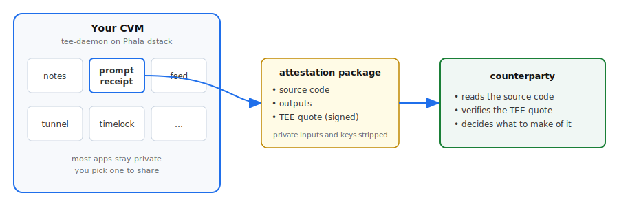

  
  A personal Vercel for attestable web apps. One Phala dstack CVM hosts many little apps you wrote yourself, and each one ships with evidence of what code actually ran.

  

## The idea

Most "deploy a function" platforms (Lambda, Vercel, Cloudflare Workers) give you cheap hosting. This one gives you that plus a proof you can hand to someone else. The proof is anchored in the TEE: an attestation package shows the source code that ran, the inputs the relying party already has, and the outputs, minus any private data or API keys you supplied.

Some things this lets you build:

- A function that takes a prompt, calls a model provider, and returns the response with a proof of the exact prompt and response.
- A function that decrypts a file escrowed on a blockchain, runs a computation on it, and returns the result with a proof of what was computed.
- A function that generates a credential via ZK-TLS and signs it inside the enclave.

You write code, your counterparty runs the output through a verifier, the verifier shows them what code ran. If they trust the sandbox, they can decide what to make of the source.

## There's always a counterparty

Every use case implies someone on the receiving end: a landlord checking rental documents, a model consumer checking that a prompt was really sent. The relying party does not need to trust you. They need to trust the sandbox and read the code.

Two paths for the code itself:

- **Improvised.** You (or your agent) write something custom for the situation. The relying party reads it before deciding what it means.
- **Pre-vetted.** A community publishes standard packets ("rental agreement v3", "model-provider receipt v1"). You pick one. The relying party trusts the packet by reputation rather than re-reading from scratch.

## One CVM, many apps

You don't need a CVM per app. A single CVM running tee-daemon hosts a hundred little apps cheaply. You share one with a counterparty; the other ninety-nine stay private.

The counterparty does not see your other apps, but they do need to trust that those other apps cannot side-channel the one they care about. That trust lives in the sandbox boundary, not in each individual app. tee-daemon supports several isolation modes for that reason: Deno sandbox per app, isolated Docker per app, gVisor for stronger separation. Pick what the relationship calls for.

Apps can be ephemeral (deploy, prove, throw away, no leftover state) or long-running. Both fit.

Multi-tenant CVMs are possible but not the default. The default is one user, one CVM, many apps.

## Status

Pre-v1. The dev-mode hosting flow works today across Deno, Node, Bun, Python, static, and custom Dockerfiles. The attested-promotion and end-to-end verification chain are designed but not yet exercised end-to-end. Closing that gap is the main thing in flight.

## Reading and discussion

A working notebook for the project's design. The substance lives in the RFC log; issues track work falling out of those RFCs.

- [Platform vision (RFC 0001)](rfcs/0001-platform-vision.md)
- [RFC log](rfcs/)
- [Known issues](ISSUES.md)
- [Developer guide](DEVELOPER_GUIDE.md)
- [GitHub repo](https://github.com/amiller/dstack-webhost)

Open a [GitHub issue](https://github.com/amiller/dstack-webhost/issues). Most of the design is still up for revision.
