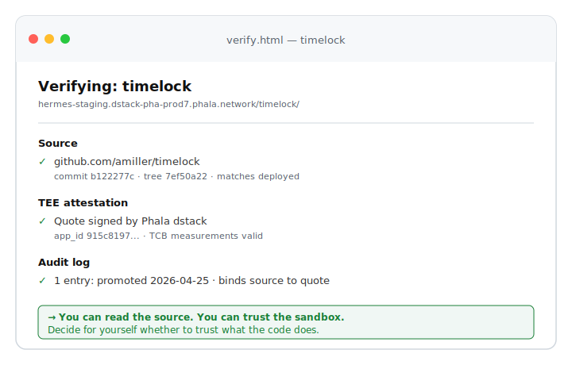

# Verifying a TEE app

Someone hands you a URL. They claim it points to a TEE-hosted app whose source code is on GitHub. Before you trust the output, you want to know what code is actually running. This is what being a relying party looks like.

The example here is **timelock**, a small app that takes an encrypted message and only releases the decryption key after a specified time. The release-time guarantee depends on the TEE keeping the key sealed and on the app using a trustworthy clock. You won't trust the output unless you've verified the code.

## Setup

You receive a link: `https://hermes-staging.dstack-pha-prod7.phala.network/timelock/`

Source is supposedly at `https://github.com/amiller/timelock`.

You should be able to do the following without any credentials I gave you. Asking for an admin token to verify a public claim defeats the point.

## The chain

What a complete verification looks like:

  

The page above is what a relying-party verifier would render. It walks four checks:

1. **Source.** Fetch `GET /_api/verification/timelock` from the daemon. It returns the project manifest including `source` (the repo URL), `commit_sha`, and `tree_hash`. Independently fetch the same commit from GitHub, compute its tree hash, and confirm it matches.
2. **TEE attestation.** The same response includes a dstack `quote`. The quote is signed by the TEE platform and binds the running daemon's measurements (TCB, boot, code) to a value derived from the project's source hash. Verify it against the Phala base contract that anchors this CVM's app id.
3. **Audit log.** Fetch `GET /_api/projects/timelock/audit`. Confirm the first entry is the `promote` event that bound this source hash, and that no later entry reflects a config or source change you weren't expecting.
4. **The verdict.** None of the above tells you whether the code is correct. It tells you what code ran. You read the source on GitHub and decide whether the logic actually does what it claims.

## What works today, what doesn't

| Step | Today | After RFC 0015 | After timelock is promoted |
|---|---|---|---|
| Fetch the running app | works | works | works |
| Fetch source from GitHub | works | works | works |
| `GET /_api/verification/timelock` | **401 (token required)** | 200, but empty (dev mode) | 200, full chain |
| Compare tree hash | blocked | blocked (no manifest) | works |
| Check TEE quote | blocked | blocked (no quote) | works |
| Audit log | blocked | blocked | works |

Two changes unlock the full flow:

- **[RFC 0015](rfcs/0015-public-verification-endpoints.md)** opens read-only verification endpoints to anonymous callers for projects in attested mode. It is a small, focused fix in `proxy/ingress.py`.
- **Promoting timelock** moves it from `dev` to `attested` and starts the audit log. The promote API already exists (`POST /_api/projects/timelock/promote`) but has not been exercised end-to-end on this CVM.

Until both land, the demo above is a rendering of what the verifier *will* show. The honest current state is: you can read [the source](https://github.com/amiller/timelock) and you can [hit the running app](https://hermes-staging.dstack-pha-prod7.phala.network/timelock/), but the daemon will not currently tell you the two are connected.

## What this generalizes to

Every relying-party flow on this platform follows the same shape: source on GitHub, manifest and quote from the daemon, audit log to detect post-deploy changes, and a verdict you make yourself. Build a single verifier and it works for any attested app on any tee-daemon CVM.
